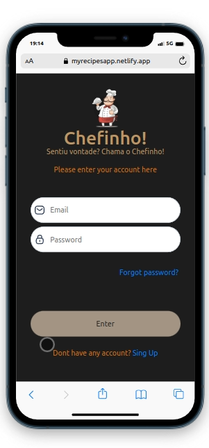

# Recipes-App

  

O Chefinho é um aplicativo de receitas onde é possível ver, buscar, filtrar, favoritar e acompanhar o progresso de preparação de receitas e drinks!
OBS: O aplicativo foi pensado para uma tela mobile e sua versão para telas maiores ainda está em desenvolvimento.

Link do Deploy: https://myrecipesapp.netlify.app/

#### Para clonar o repositório e rodar localmente a aplicação siga as instruções abaixo

1. Clonando o repositório
* ` git@github.com:GuilhermeRX/Recipes-App.git `
* Entre no repositório que acabou de clonar:
  * `cd  Recipes-App`

2. Instale as dependências 
* `npm install `.

3. Starte a aplicação.
* `npm start`
